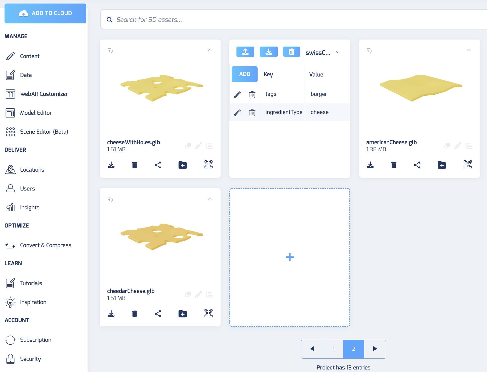
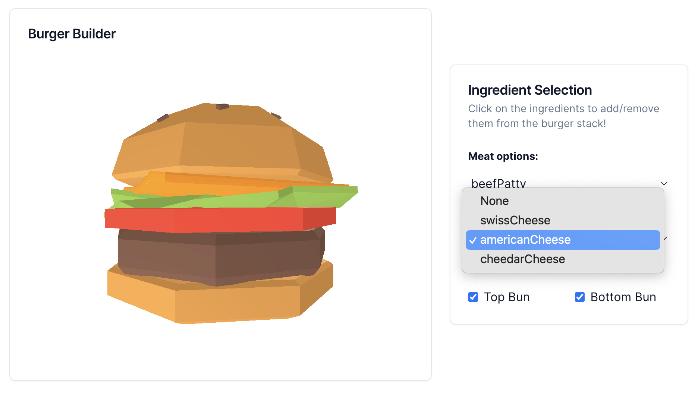
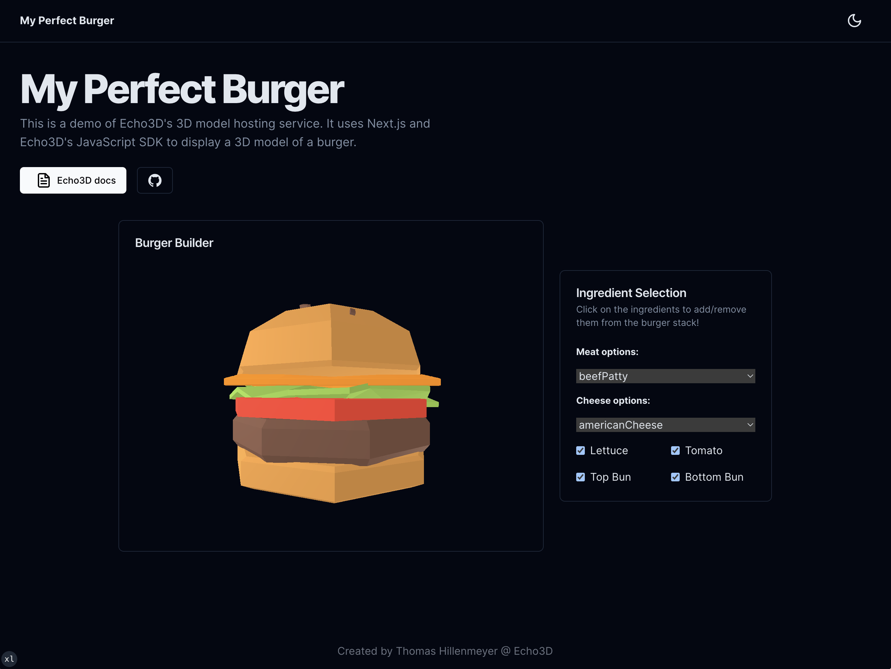
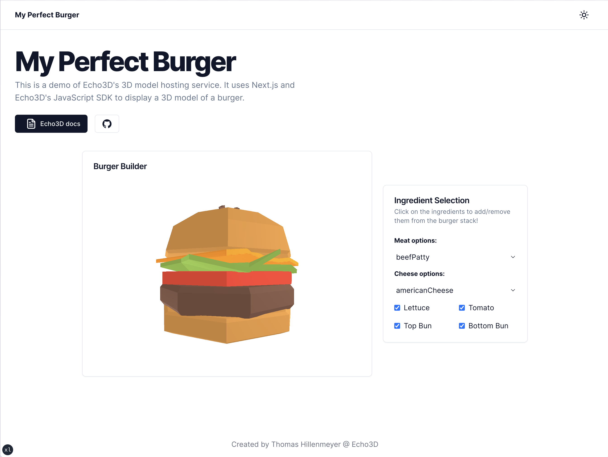

# My Perfect Burger - 3D Burger Builder Web App

## Overview

A web application that allows users to create and customize their own 3D burgers using a variety of ingredients. The app utilizes React for the frontend, Tailwind CSS for styling, and Three.js for 3D rendering.

## Table of Contents

1. [Setup](#setup)
2. [Architecture](#architecture)
3. [User Interface](#user-interface)
4. [Burger Customization](#burger-customization)
5. [Real-time 3D Rendering](#real-time-3d-rendering)
6. [Demo/Screenshots](#demo-screenshots)

## Setup

Register for FREE at [echo3D](https://console.echo3D.com/#/auth/register).

1. Clone the repository
`git clone https://github.com/echo3Dco/my-perfect-burger.git`

2. Install dependencies
`npm install`

### Connecting to your Echo3D console

1. Navigate to `components/BurgerCustomizationArea.tsx` 
2. On line 46, replace `const apiKey = "abcd-efgh-1234"` with your Echo3D api key to access your Echo3D console database.

### Adding ingredients for the App in Echo3D console

Upload test assets from `assets/` directory to your Echo3D console database 

#### For all assets:
- Add `'tags': 'burger'` to each asset's metadata in the Echo3D console. Assets are dynamic to what exists in the echo3D database. 
- Only the objects containing this key/value pair will be added to the Application.

#### For 'meat' or 'cheese' assets:
- Add `'ingredientType': 'meat'` to each meat object's metadata in the echo3D console.
- Add `'ingredientType': 'cheese'` to each cheese object's metadata in the echo3D console.

### Start the development server
`npm run dev`

The web app will be accessible at `http://localhost:3000`.

## Example:

I have various cheese GLB objects in my database. 

They will appear in the `Cheese options` selector if they are tagged with the following key/value pairs in their metadata:
- `tags: burger`
- `ingredientType: cheese`

## Architecture

### Frontend

- Framework: React/Next.js
- Styling: TailwindCSS + shadcn/ui
- 3D Rendering Engine: Three.js

### Backend

- Server-rendering: Next.js
- 3D Asset Management: echo3D

## User Interface

### Components

1. Navbar
2. Instructions / Tooltips
3. Ingredient Selection Panel
4. Burger Customization Area

### Responsiveness

The app is designed to be responsive and accessible on various devices and screen sizes.

## 3D Assets and Optimization

### Asset Creation

High-quality, realistic 3D models were created for various ingredients:

- Buns
- Patties
- Cheese
- Lettuce
- Tomato

### Asset Optimization

- Using echo3D to deliver optimized 3D objects for faster loading times and improved web performance.

## Burger Customization

### Functionality

- Select ingredients from dropdown menus and checkboxes
- Add or remove ingredients dynamically to the burger stack
- Visual feedback (e.g. Toast alerts) to indicate any errors occuring throughout the app, ex. failed to load objects.

## Real-time 3D Rendering

### Rendering Engine

Implemented Three.js to display the custom burger in real-time as the user adds or modifies ingredients.

## Demo/Screenshots 

Dark theme:

Light theme:

